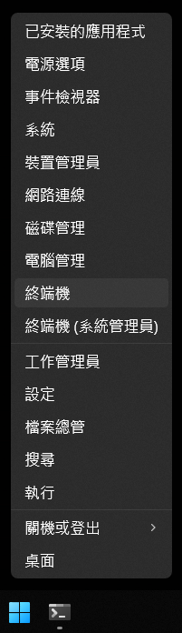
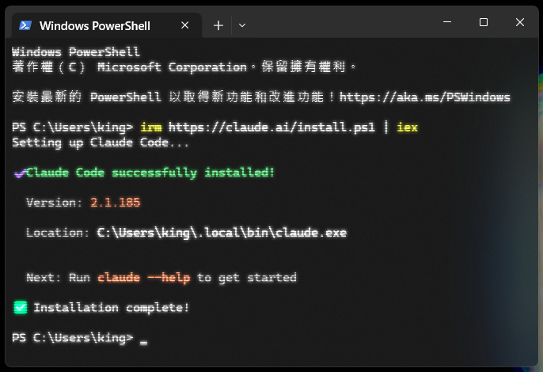
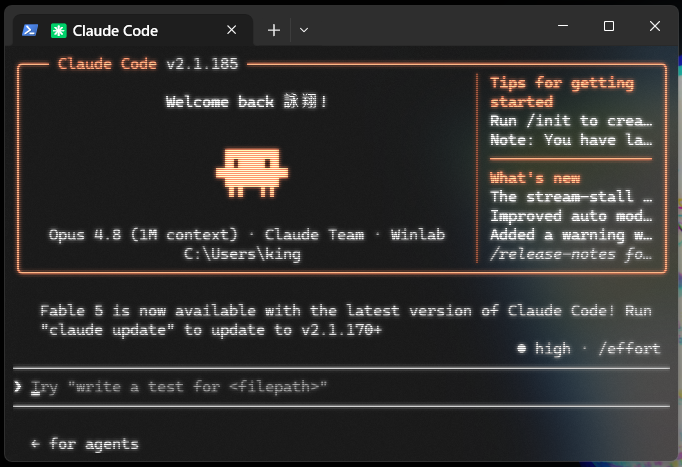

# 第 0 章 — 環境準備（Onboarding）

目標：把一台全新的電腦，弄到 **Claude Code 跑得起來、而且能幫你把開發環境整個裝好** 的狀態。

你會做四件事：

1. 打開終端機
2. 安裝 Claude Code
3. 啟動並登入
4. 把 `setup.md` 交給它，自動裝好開發工具

完全不需要終端機經驗，跟著你的系統做就好 —— **Windows** 或 **macOS**。

---

## 1. 打開終端機

### 🪟 Windows

**對著左下角的「開始」按鈕按右鍵**，在跳出來的選單裡點 **終端機**：



> 找不到「終端機」？Windows 10 可能沒有，改點 **Windows PowerShell** 也可以（或到 Microsoft Store 安裝「Windows 終端機」）。

打開後預設是 **PowerShell**。怎麼看自己在哪種環境？看那一行開頭的提示字：

- `PS C:\Users\你的名字>` → 你在 **PowerShell**
- `C:\Users\你的名字>`（開頭沒有 `PS`）→ 你在 **CMD**

這會影響下一步要貼哪一個安裝指令。

### 🍎 macOS

按 **⌘ + 空白鍵**，輸入 `Terminal`，按 Enter，就會打開「終端機」。

---

## 2. 安裝 Claude Code

把對應你系統的指令複製、貼到終端機、按 Enter，等它跑完。

### 🪟 Windows — 在 **PowerShell** 裡：

```
irm https://claude.ai/install.ps1 | iex
```

跑完看到 `Claude Code successfully installed!` 就成功了：



> 如果你的提示字開頭是 `C:\`、沒有 `PS`（代表你在 **CMD**），改用這一行：
> ```
> curl -fsSL https://claude.ai/install.cmd -o install.cmd && install.cmd && del install.cmd
> ```
> 簡單判斷：**提示字有 `PS` 就用最上面的 `irm`，只有 `C:\` 就用這一行。**

### 🍎 macOS：

```
curl -fsSL https://claude.ai/install.sh | bash
```

裝完後，**把終端機關掉、重新開一個**，讓它認得新的 `claude` 指令。

---

## 3. 啟動 Claude Code 並登入

在終端機輸入：

```
claude
```

第一次會自動打開瀏覽器要你登入。**Claude Code 需要付費方案** —— Claude Pro、Max、Team 或 Enterprise 都可以，免費方案不能用。登入並授權。

回到終端機，看到 Claude Code 的畫面（像下面這樣，最底下有一個可以打字的輸入框）就代表進去了 🎉



> 想再確認裝得好不好，可以輸入 `claude doctor` 檢查。

---

## 4. 讓 Claude Code 幫你裝好開發環境

接下來把這一章的 [`setup.md`](./setup.md) 交給 Claude Code，它會幫你裝好工具（Git、Node.js、Python/uv、GitHub CLI）並帶你綁定 GitHub 帳號。

**最簡單的方式** —— 直接把這句貼給 Claude Code：

> 讀 https://raw.githubusercontent.com/zyx1121/cc/main/0.onboarding/setup.md 這份文件，照著裡面的步驟幫我把開發環境準備好。

> 已經把這個 repo 下載到電腦上了？那也可以 `cd` 進 `0.onboarding`，在裡面啟動 `claude`，輸入 `@setup.md` 再請它幫你配置環境。

剩下的 Claude Code 會自己接手。輪到 **登入 GitHub** 那一步時，**那部分要你自己在瀏覽器完成** —— 它會一步一步引導你。

---

這就是第 0 章。環境準備好之後，你就可以接著上後面的章節了。
