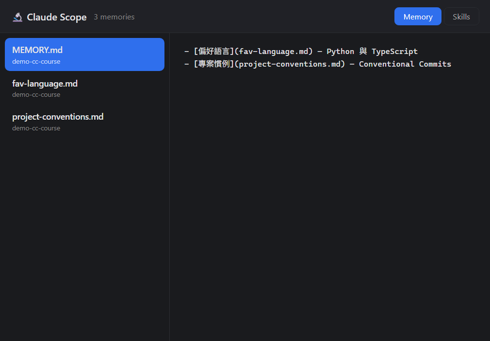
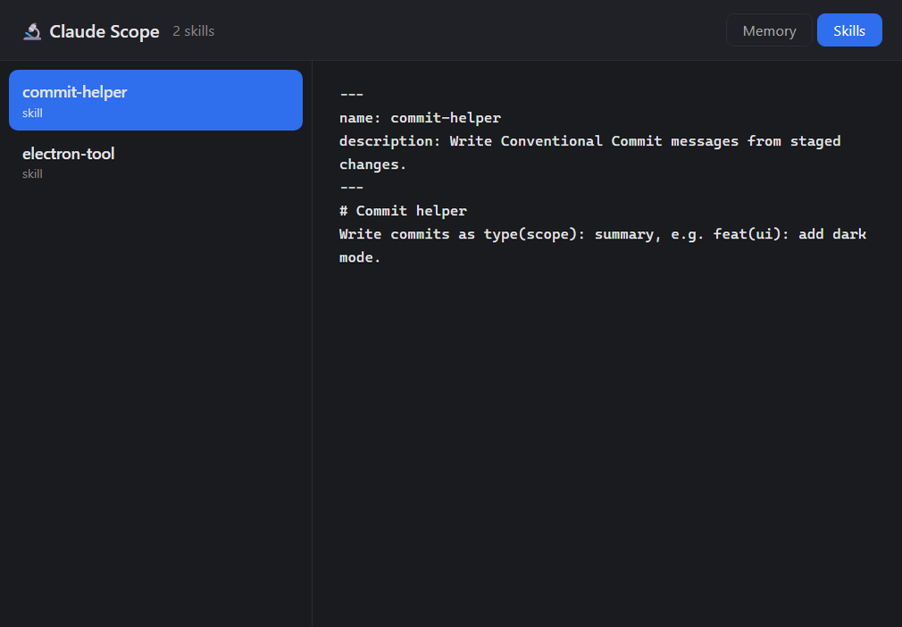

# 第 4 章 — 迭代:用 Skill 把內視鏡養大

走到這裡,你已經:Ch2 做出內視鏡(看 memory)、Ch3 把開發經驗封成了 `electron-tool` skill。這一章把兩者合起來 —— **回頭把內視鏡加上「看 Skill」的功能**,而且你會親身感覺到:**這次因為有了那個 skill,開發明顯更順。** 這就是固化經驗的回報:Ch3 存下來的 SOP,Ch4 馬上受益。

---

## 痛點:它只看得到一半

你的內視鏡現在只能看 memory。但你 Ch3 才發現,**Skill 也是 Claude Code 的重要資產**(它們放在 `~/.claude/skills/`)。既然都做了一個內視鏡了,何不讓它連 skill 也一起看?

---

## 先讓 Claude 摸熟現有專案:`/init`

迭代一個既有專案,最好先讓 Claude 搞懂它現在長什麼樣。在內視鏡的專案資料夾啟動 `claude`,打:

```
/init
```

`/init` 會讓 Claude 把整個專案掃一遍,把架構、慣例記進專案的 `CLAUDE.md`。之後它加功能就會貼合現有的 code,不會亂改一通。

---

## 加功能:讓它也能看 Skill

現在描述你要的新功能。**留意這次 Claude 接得有多順** —— 因為它同時有「`/init` 摸熟的專案」+「Ch3 那個 electron-tool skill(早就知道這類 app 的正確姿勢)」:

> 在現有的內視鏡上加一個功能:頂部放一個 Memory / Skills 切換。切到 Skills 時,左邊改成列出 `~/.claude/skills/` 底下每個 skill(讀它們的 `SKILL.md`),點開一樣在右邊顯示內容。

### 🔑 關鍵時刻:你存下來的經驗,回頭加速了你

你會注意到:同樣是「加一個讀本地檔 + 列表顯示」的任務,這次 Claude **幾乎不用你再解釋 preload / IPC / 安全讀檔那一套了** —— 它早就會(skill 裡寫著)。Ch3 你花力氣存下來的 SOP,在 Ch4 回頭幫你省了一大段。這就是「**固化 → 加速**」的正循環。

---

## 跑起來看看

`npm start`。現在頂部能切換,Skills 模式列出你的 skill、點開看 `SKILL.md`:





> 記得 Ch3 做的 `electron-tool` skill 嗎?它就在這份清單裡 —— **你的工具,正在看著「你拿來做工具的那個經驗」。**

做好了,老樣子 `git commit` 存一版。

---

## 成品 + 挑戰

**跟著做**:內視鏡 v2 —— memory 和 skills 都能看。

**進階挑戰**:
- 在 UI 裡直接**啟用 / 停用** skill;
- 把每個 skill 的 `description`(從 frontmatter 抽出來)顯示成副標,一眼看出它幹嘛;
- 加個搜尋框。

---

## 課程到這裡 🎉

你一路從:**空電腦(Ch0)→ 認識 Claude(Ch1)→ 做出第一個 app(Ch2)→ 把經驗封成 skill(Ch3)→ 用 skill 把 app 養大(Ch4)**。

你已經走完一個完整的循環:**用 Claude Code 做出真的東西,並讓它越用越順。** 接下來,換你拿這套,去做你自己想做的東西。

---

⬅️ 上一章:[`3.make-it-a-skill`](../3.make-it-a-skill/)
